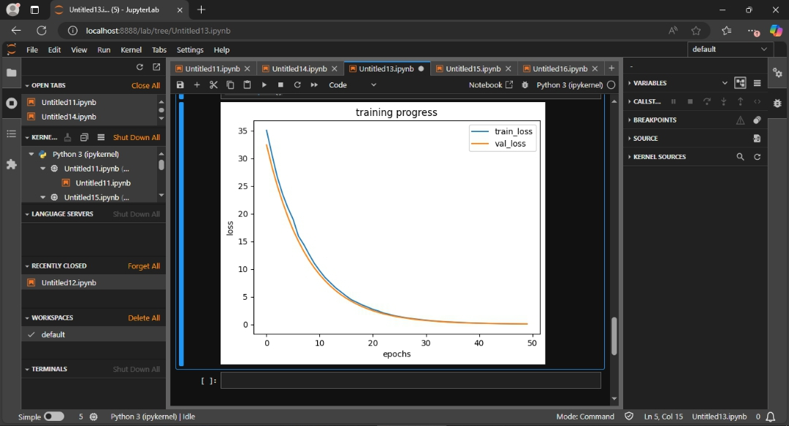

# Linear Regression on Synthetic Data with PyTorch

A from-scratch implementation of linear regression with **L2 regularization (weight decay)** using **PyTorch**, trained on synthetic data with VC dimension analysis and generalization bounds.

## 📊 Overview

This project demonstrates:
- **Linear regression** implemented with PyTorch's `nn.Module`
- **L2 regularization (weight decay)** to prevent overfitting
- **Synthetic data generation** with controllable parameters
- **Training/validation splits** for generalization assessment
- **Loss curve visualization** with `matplotlib`
- **VC dimension analysis** to understand generalization guarantees

## 🧮 Model Architecture

- **Type**: Linear regression with L2 regularization
- **Framework**: PyTorch (`nn.Linear`, `nn.MSELoss`)
- **Regularization**: L2 (weight decay in optimizer)
- **Features**: 2 input features → 1 output
- **Parameters**: 3 total (2 weights + 1 bias)
- **VC Dimension**: 3 (features + 1)
- **Optimizer**: SGD with weight decay

## 📈 Results

### Loss Curves


*Figure 1: Training and validation loss over 50 epochs with L2 regularization (PyTorch implementation)*

### Generalization Analysis

| Metric | Value |
|--------|-------|
| Training samples | 1000 |
| VC Dimension | 3 |
| Regularization | L2 (weight decay = 0.001) |
| Confidence level | 95% (δ = 0.05) |
| **Generalization bound** | **~6.3%** |

**Bound calculation:**
```
Gap = √((VC - log δ)/n)
    = √((3 - log 0.05)/1000)
    = √(3 + 1.301/1000)
    = √4.301/1000
    = 0.06324 (6.3%)
```

**Interpretation**: With 95% confidence, the difference between training error and true population error is ≤ 6.3%. L2 regularization helps keep this gap small by constraining model complexity.

## 🏗️ Project Structure

```
linear_regression_on_synthetic_data/
├── loss_curve.png                    # Training visualization
├── data/
│   └── synthetic_data.py          # Data generation (NumPy → PyTorch tensors)
├── module/
│   ├── module.py                   # Core
│   ├── data_module.py 
│   └── trainer.py                   # PyTorch training loop with regularization
├── src/
│   └── linear_regression_model.py   # nn.Module subclass
├── main.py                           # Entry point
└── README.md                          # You are here
```

## 🚀 Getting Started

### Prerequisites
```bash
pip install torch matplotlib numpy
```

### Running the project
```bash
python main.py
```


## 📚 Key Learnings

This project demonstrates understanding of:

- ✅ PyTorch `nn.Module` subclassing
- ✅ PyTorch `DataLoader` for batching
- ✅ Linear regression mathematics
- ✅ **L2 regularization via weight decay**
- ✅ Gradient descent optimization in PyTorch
- ✅ Train/validation splits
- ✅ Loss curve interpretation with matplotlib
- ✅ VC dimension theory
- ✅ Generalization bounds
- ✅ Clean code organization

## 🔬 Regularization Impact

| weight_decay | Effect |
|--------------|--------|
| 0.0 | No regularization (standard linear regression) |
| 0.0001 - 0.001 | Mild regularization |
| 0.001 - 0.01 | Balanced regularization |
| > 0.01 | Strong regularization, may underfit |

## 🔍 Future Improvements

- [ ] Experiment with L1 regularization (via custom loss)
- [ ] Add learning rate scheduling
- [ ] Implement early stopping
- [ ] Test on real datasets
- [ ] Add tensorboard for visualization

## 📝 License

MIT

## 👨‍💻 Author

Joseph Tobi Mayokun

---

*Built as part of my journey mastering machine learning foundations—implementing theory (VC dimension) with modern tools (PyTorch).*
